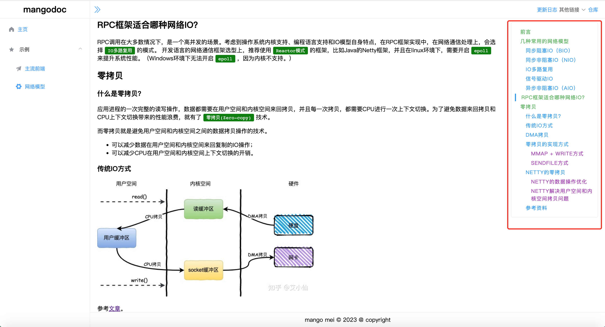

# mangodoc-toc
mangodoc toc plugin，文章目录插件！

[](https://www.npmjs.com/package/mangodoc-toc)




## Usage

1. Configure mangodoc-toc:(配置值详情请参考 https://giscus.app/zh-CN ）

    ```html
    <script>
    window.$mangodoc = {
      toc:{
        select: "h2,h3,h4,h5,h6"
      }
    }
    </script>
    ```

2. Insert script into mangodoc document:

    ```html
    <!-- toc文章目录  -->
    <link rel="stylesheet" href="https://cdn.jsdelivr.net/npm/mangodoc-toc@1.0.1/dist/toc.css">
    <script src="https://cdn.jsdelivr.net/npm/mangodoc-toc@1.0.1/dist/mangodoc-toc.min.js"></script> 
    ```
